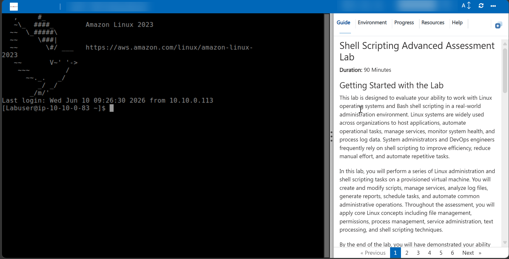
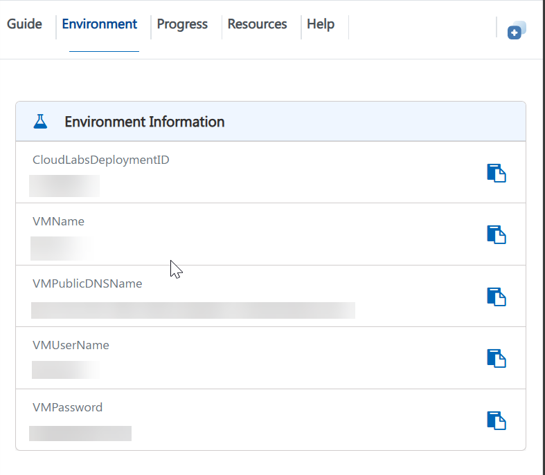
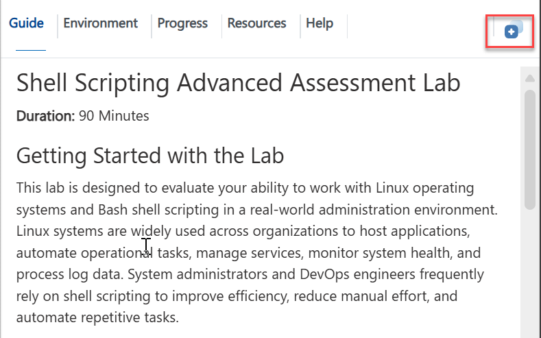
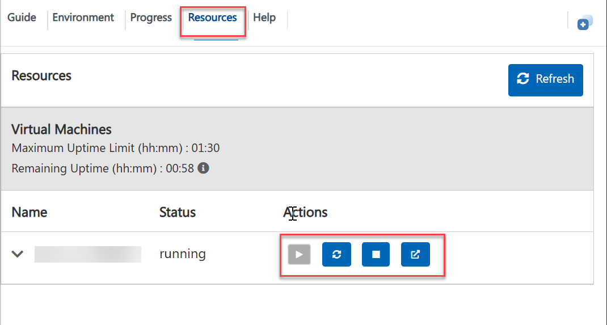
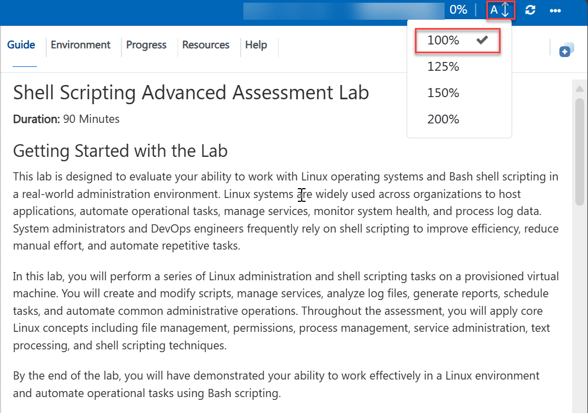
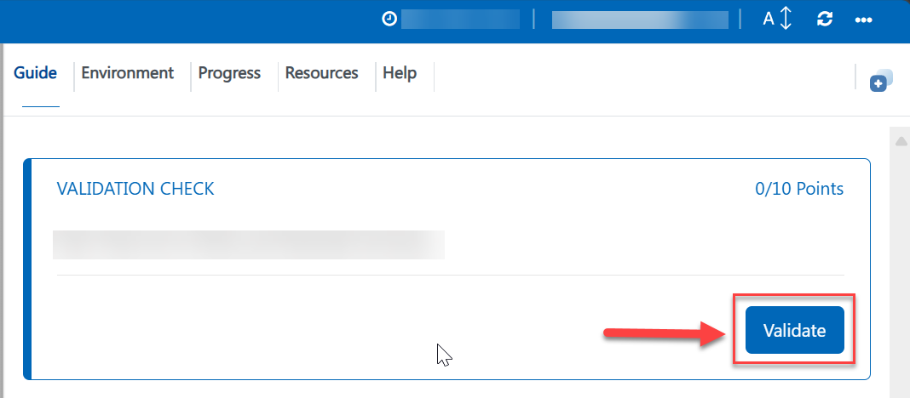

# Shell Scripting Advanced Assessment Lab

**Duration:** 90 Minutes

## Getting Started with the Lab

This lab is designed to evaluate your ability to work with Linux operating systems and Bash shell scripting in a real-world administration environment. Linux systems are widely used across organizations to host applications, automate operational tasks, manage services, monitor system health, and process log data. System administrators and DevOps engineers frequently rely on shell scripting to improve efficiency, reduce manual effort, and automate repetitive tasks.

In this lab, you will perform a series of Linux administration and shell scripting tasks on a provisioned virtual machine. You will create and modify scripts, manage services, analyze log files, generate reports, schedule tasks, and automate common administrative operations. Throughout the assessment, you will apply core Linux concepts including file management, permissions, process management, service administration, text processing, and shell scripting techniques.

By the end of the lab, you will have demonstrated your ability to work effectively in a Linux environment and automate operational tasks using Bash scripting.

---

# Accessing Your Lab Environment

Once you're ready to begin, your Linux virtual machine and lab guide will be available directly within your browser.

## Virtual Machine & Lab Guide

Your virtual machine is the environment where all lab activities will be performed. The lab guide provides step-by-step instructions and validation requirements for each task.


---

# Exploring Your Lab Resources

To view environment information, credentials, and resource details, navigate to the **Environment** tab.



---
# Utilizing the Split Window Feature

For convenience, you can open the lab guide in a separate window by selecting the Split Window button from the Top right corner.



# Connecting to the Virtual Machine

You may connect to the Linux virtual machine using SSH.

### SSH Command

```bash
ssh <inject key="VMUserName" enableCopy="true"/>@<inject key="VMPublicDNSName" enableCopy="true"/>
```

### Username

```text
<inject key="VMUserName" enableCopy="true"/>
```

### Password

```text
<inject key="VMPassword" enableCopy="true"/>
```

---

These commands should display your current username and the hostname of the lab virtual machine.

---

# Managing Your Virtual Machine

You may Start, Restart, or Stop your virtual machine at any time using the **Resources** tab available within the lab environment.



---

# Lab Guide Zoom In / Zoom Out

To adjust the zoom level of the lab environment page, use the zoom controls located next to the session timer.



---

# Lab Validation

After completing each task, select the **Validate** button located within the Validation section of the lab guide.

* If validation succeeds, proceed to the next task.
* If validation fails, carefully review the error message and revisit the task instructions before attempting validation again.



---

# Support Contact

The CloudLabs support team is available 24/7 throughout your lab experience.

### Learner Support

**Email Support:** [labs-support@spektrasystems.com](mailto:labs-support@spektrasystems.com)

**Live Chat Support:** https://cloudlabs.ai/labs-support

---

Click **Next >>** to begin the assessment.
